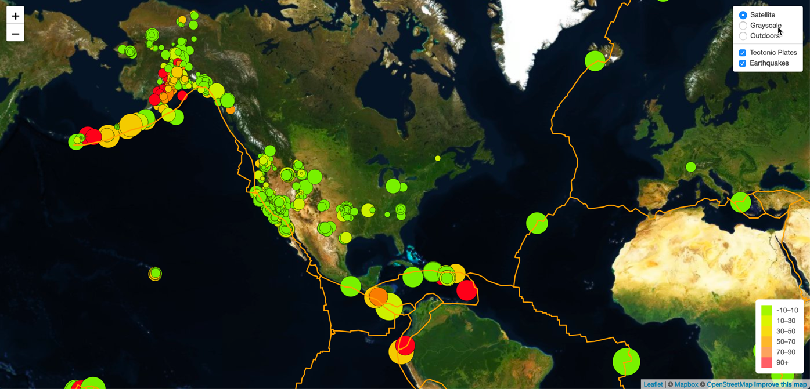

To run these files successfully, I open them up in Visual Studio.
From the index.html file, I open a new terminal at the bottom of  the screen.
I then type at the cursor location the following,
python -m http.server
A couple of lines show up at the bottom screen.
I press ctrl and click on the (http://0.0.0.0:8000/)
This will open up a pop up window and click on the open window button
A new tab opens up in my internet browser.  I then change the url from http://0.0.0.0:8000/ to 
127.0.0.1:8000/Leaflet-Step-1 in my computer.  For the grader, maybe you do not need the Leaflet-Step-1 or you may not need to change the 0.0.0.0:8000
I am using a Windows 10 Home 64 bit OS.
The Test Subject ID defaults to 940, and the demographic info, bar chart, gauge and bubbles charts default to this subject data.  See how everything changes
by changing the test subject id in the dropdown menu.  The bonus part about the gauge chart was incorporated into the main app.js, so no need for a bonus.js file. I am glad that I got everything to work fine.
## Background

Welcome to the United States Geological Survey, or USGS for short! The USGS is responsible for providing scientific data about natural hazards, the health of our ecosystems and environment; and the impacts of climate and land-use change. Their scientists develop new methods and tools to supply timely, relevant, and useful information about the Earth and its processes. As a new hire, you will be helping them out with an exciting new project!

The USGS is interested in building a new set of tools that will allow them visualize their earthquake data. They collect a massive amount of data from all over the world each day, but they lack a meaningful way of displaying it. Their hope is that being able to visualize their data will allow them to better educate the public and other government organizations (and hopefully secure more funding..) on issues facing our planet.

### Before You Begin

1. Create a new repository for this project called `leaflet-challenge`. **Do not add this homework to an existing repository**.

2. Clone the new repository to your computer.

3. Inside your local git repository, create a directory for the Leaflet challenge. Use the folder names to correspond to the challenges: **Leaflet-Step-1** and **Leaflet-Step-2**.

4. This homeworks utilizes both **html** and **Javascript** so be sure to add all the necessary files. These will be the main files to run for analysis.

5. Push the above changes to GitHub or GitLab.

## Your Task

### Level 1: Basic Visualization

Your first task is to visualize an earthquake data set.

1. **Get your data set**

   

   The USGS provides earthquake data in a number of different formats, updated every 5 minutes. Visit the [USGS GeoJSON Feed](http://earthquake.usgs.gov/earthquakes/feed/v1.0/geojson.php) page and pick a data set to visualize. When you click on a data set, for example 'All Earthquakes from the Past 7 Days', you will be given a JSON representation of that data. You will be using the URL of this JSON to pull in the data for our visualization.

   

2. **Import & Visualize the Data**

   Create a map using Leaflet that plots all of the earthquakes from your data set based on their longitude and latitude.

   * Your data markers should reflect the magnitude of the earthquake by their size and and depth of the earth quake by color. Earthquakes with higher magnitudes should appear larger and earthquakes with greater depth should appear darker in color.

   * **HINT** the depth of the earth can be found as the third coordinate for each earthquake.

   * Include popups that provide additional information about the earthquake when a marker is clicked.

   * Create a legend that will provide context for your map data.

   * Your visualization should look something like the map above.

- - -

### Level 2: More Data (Optional)

The USGS wants you to plot a second data set on your map to illustrate the relationship between tectonic plates and seismic activity. You will need to pull in a second data set and visualize it along side your original set of data. Data on tectonic plates can be found at <https://github.com/fraxen/tectonicplates>.

In this step we are going to..

* Plot a second data set on our map.

* Add a number of base maps to choose from as well as separate out our two different data sets into overlays that can be turned on and off independently.

* Add layer controls to our map.

- - -

### Assessment

Your final product will be assessed on the following metrics:

* Completion of assigned tasks

* Visual appearance

* Professionalism

* Ensure your repository has regular commits (i.e. 20+ commits) and a thorough README.md file
